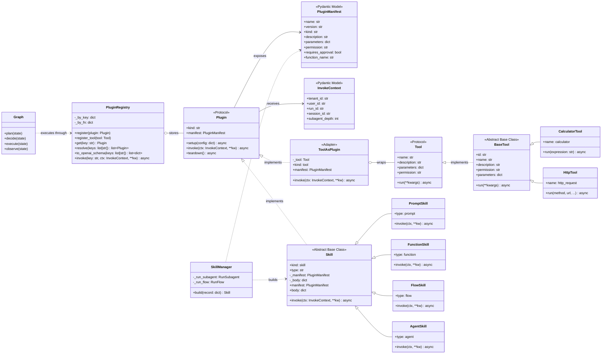
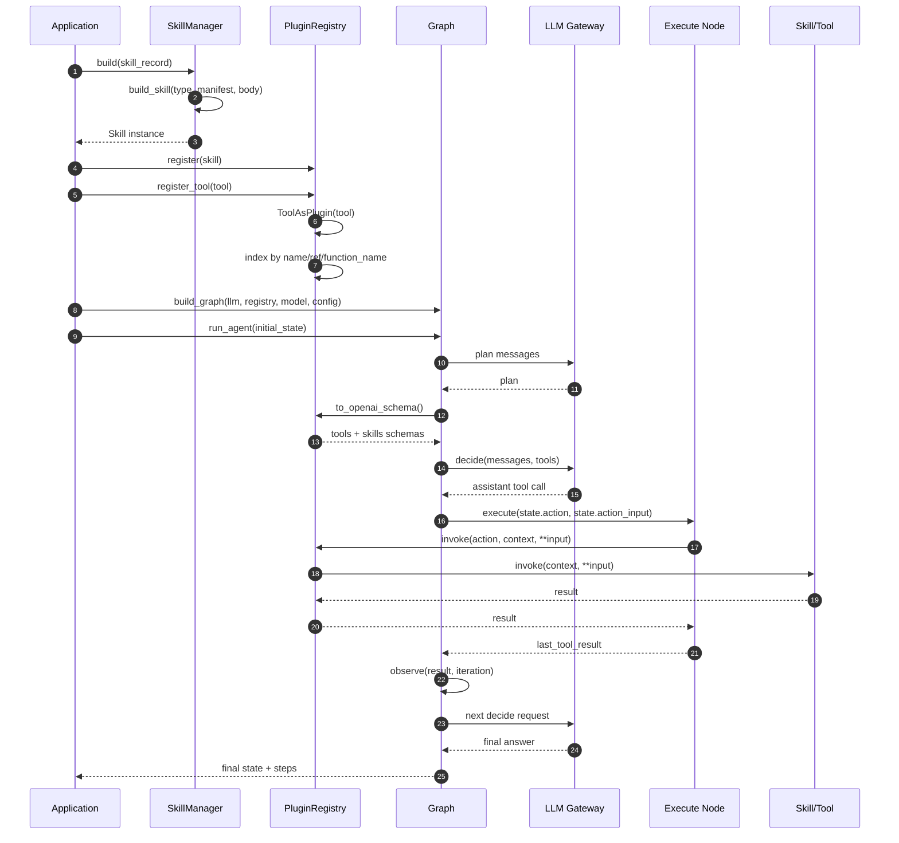

# Plugins, Tools and Skills UML

本文档描述 Ouroboros 当前实现中 plugins、tools、skills 的核心结构和调用关系。

## 1. 核心类图



### 关键设计点

- `Plugin` 是统一运行时协议，要求插件提供 `manifest`、`setup`、`invoke` 和 `teardown`。
- `Tool` 保留旧的 `run(**kwargs)` 接口；`ToolAsPlugin` 将它适配为 `Plugin.invoke(ctx, **kw)`。
- `Skill` 是 `Plugin` 的抽象实现，具体形式由 `type` 区分：`prompt`、`function`、`flow`、`agent`。
- `PluginManifest.function_name` 负责生成提供给 LLM 的函数名：普通 tool 使用原名，skill 使用 `skill_` 前缀。
- `PluginRegistry` 不区分 tool 和 skill 的执行入口，统一通过 `register`、`get`、`invoke` 管理。

## 2. Graph 调用时序图



## 3. 注册和解析关系

```mermaid
flowchart TD
    A[Application assembly] --> B[SkillManager.build(record)]
    B --> C[Concrete Skill]
    D[Legacy Tool] --> E[PluginRegistry.register_tool]
    E --> F[ToolAsPlugin]
    C --> G[PluginRegistry.register]
    F --> G
    G --> H{Plugin indexes}
    H --> H1[bare name]
    H --> H2[kind:name@version]
    H --> H3[manifest.function_name]
    H1 --> I[PluginRegistry.get/resolve/invoke]
    H2 --> I
    H3 --> I
    I --> J[Unified Plugin.invoke]
```

## 4. 当前代码对应关系

| UML 元素 | 代码位置 |
| --- | --- |
| `Plugin`, `PluginManifest`, `InvokeContext`, `ToolAsPlugin` | `src/ouroboros/plugins/base.py` |
| `PluginRegistry` | `src/ouroboros/plugins/registry.py` |
| `Tool`, `BaseTool`, `ToolResult` | `src/ouroboros/tools/base.py` |
| Built-in tools | `src/ouroboros/tools/builtin/` |
| `Skill`, `build_skill` | `src/ouroboros/skills/base.py` |
| `PromptSkill`, `FunctionSkill`, `FlowSkill`, `AgentSkill` | `src/ouroboros/skills/` |
| `SkillManager` | `src/ouroboros/skills/manager.py` |
| Graph execution | `src/ouroboros/core/graph.py` and `src/ouroboros/core/nodes/` |

## 5. 示例

在 Graph 中集成 skill 的最小示例见 `example/skills_example.py`：

1. 用 `SkillManager` 从 record 构建 skill。
2. 用 `PluginRegistry.register` 注册 skill。
3. 用 `build_graph` 将 registry 交给运行图。
4. LLM 根据 schema 选择 skill。
5. `execute` 节点通过 `registry.invoke` 执行 skill。
